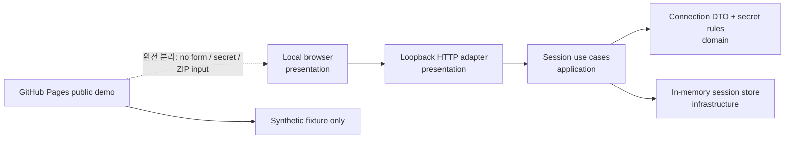
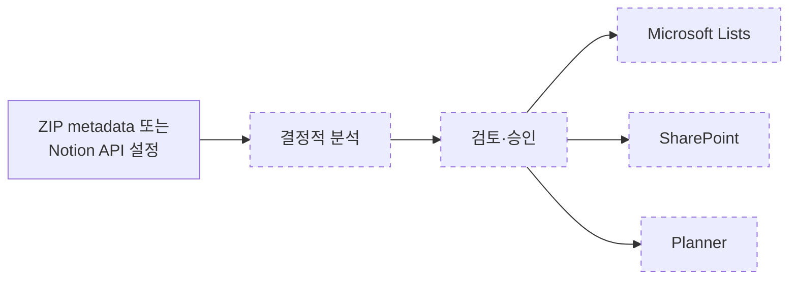

# Notion2Loop

[](https://github.com/t-hajongkim/test/actions/workflows/ci.yml)

Notion2Loop는 Notion 내보내기 자료를 읽고, Microsoft Loop로 옮길 때 무엇을 그대로 살릴 수 있고 무엇을 사람이 검토해야 하는지 보여 주는 **로컬 실행형 프로토타입**입니다.

> [!IMPORTANT]
> [공개 데모](https://t-hajongkim.github.io/test/)는 **실제 이전 서비스가 아닌 합성 샘플 기반 오프라인 분석 데모**입니다. 저장소의 가상 fixture만 분석하며 실제 Notion API나 Microsoft Loop에 연결하지 않습니다.
>
> 화면의 **73%는 실제 완료율이 아닌 예상 의미 보존 점수**입니다. 실제 Notion 자료, 회사 문서, 개인정보, `.env` 또는 토큰을 이 저장소에 업로드하거나 커밋하지 마세요.

## CI와 공개 데모

CI는 모든 main 대상 pull request와 main push에서 Node.js 24로 타입·테스트·빌드와 로컬 데모 생성을 검증합니다. pull request에서는 여기까지만 실행하고 배포하지 않습니다.

main push에서는 `Validate prototype` 성공 후에만 합성 fixture로 `output/demo`를 새로 만들고, 모든 HTML/JSON의 절대 경로, `file://` URI, 이메일, 전화번호, 토큰 형태 값을 검사합니다. 통과한 디렉터리만 workflow artifact로 전달해 공식 GitHub Pages actions로 배포합니다. `build-pages`와 `deploy`가 `validate`를 `needs`로 요구하므로 검증 실패 시 배포되지 않습니다.

Pages를 사용하려면 저장소가 GitHub Pages를 지원하는 공개 범위 또는 요금제여야 하며, **Settings → Pages → Build and deployment → Source**가 **GitHub Actions**로 설정되어야 합니다.

## 빠르게 실행하기

Node.js 24가 필요합니다. 터미널에서 `node --version`을 실행했을 때 `v24`로 시작하는지 확인하세요.

```powershell
npm ci
npm run typecheck
npm test
npm run build
npm run local-app
npm run demo
npm run public-demo
npm run check:public-demo
npm run serve
```

`npm run local-app`을 실행한 뒤 브라우저에서 <http://127.0.0.1:4174>를 열면 **로컬 연결 마법사**를 사용할 수 있습니다. 첫 화면의 **시작**을 누르고 Source, Notion, Microsoft, Target, 향후 흐름을 차례로 확인합니다. 서버를 끝내려면 터미널에서 `Ctrl+C`를 누르세요.

마법사의 ZIP 선택기는 이번 단계에서 **파일 이름과 크기만** 프로세스 메모리로 전달합니다. ZIP 내용은 업로드하거나 분석하지 않습니다. Notion token도 프로세스 메모리에만 있고 URL, HTML, 로그, 파일, `localStorage`, `sessionStorage`, `output/`에 기록하지 않습니다. 화면의 **Notion 토큰 지우기** 또는 **세션 종료 및 모두 삭제**를 사용하거나 서버를 종료하면 해당 메모리 참조를 제거합니다. JavaScript 런타임 특성상 물리 메모리의 즉시 완전 소거를 보장하는 기능은 아닙니다.

기존 합성 데모 검토 화면은 `npm run demo` 후 `npm run serve`로 실행하고 <http://127.0.0.1:4173>에서 봅니다. `local-app`과 `serve`는 서로 다른 화면과 포트를 사용합니다.

직접 준비한 로컬 내보내기를 분석하려면 다음 명령을 사용할 수 있습니다. 입력 폴더나 ZIP은 저장소 밖에 두는 것을 권장합니다.

```powershell
npm run migrate -- --input "..\notion-export" --output output\migration
npm run serve -- --directory output\migration
```

일반 `migrate`와 `demo`의 `output/`에는 입력·출력 위치 같은 로컬 절대 경로가 포함될 수 있으므로 Git에서 항상 제외됩니다. 공개용 `public-demo`만 합성 fixture를 강제하고 공개 메타데이터로 생성한 뒤 전체 파일을 검사합니다.

## 현재 할 수 있는 일

- 살균된 Notion Markdown/CSV 디렉터리 또는 ZIP과 보조 API 스냅샷 읽기
- 페이지, 데이터베이스, 행, 첨부 파일, 계층과 관계를 정규화한 그래프로 만들기
- 항목을 `native`, `transformed`, `manual`, `blocked`로 분류하기
- 수식, 롤업, 관계, 지원되지 않는 블록에 대한 검토 작업 만들기
- 위험한 경로, 너무 큰 입력, 소스 안의 명령문 형태 텍스트를 탐지하기
- 정제된 HTML 미리보기, JSON 보고서, 로컬 정적 대시보드 만들기

데모 화면의 **73%는 실제 자료의 73%가 이전되었다는 뜻이 아닙니다.** 가상 fixture의 항목과 관계에 가중치를 적용해 계산한 **예상 의미 보존 점수**입니다. 실제 이전 완료율, 정확도 또는 Microsoft Loop 반영 결과로 해석하면 안 됩니다.

## 구조

이 프로젝트는 한 프로세스에서 로컬 파일을 처리하는 **로컬 우선 모듈러 모놀리스**이며, 기능별로 코드를 모으는 feature-first DDD 방식을 사용합니다.

```text
src/features/
  workspace-ingestion/       # Notion 내보내기 읽기와 정규화
  compatibility-analysis/    # 호환성 및 예상 의미 보존 분석
  loop-package/              # 정적 검토 패키지 생성과 로컬 제공
  migration-run/             # 전체 흐름과 CLI
  public-demo/               # 합성 fixture 계약과 공개 산출물 개인정보 검사
  connection-setup/          # localhost 연결 DTO, 메모리 세션, 단계형 UI
```

각 기능 안에서 `domain`, `application`, `infrastructure`, `presentation` 계층을 필요한 만큼 나눕니다. 외부 서비스 연결보다 도메인 규칙과 로컬 검토 흐름을 먼저 검증하도록 설계했습니다.



로컬 마법사는 한 사용자 행동을 한 feature에서 끝까지 연결합니다. 레이어별로 별도 브랜치를 만들지 않으며, dependency는 presentation/infrastructure에서 application/domain 방향으로 향합니다.



실선은 제품의 장기 흐름을 나타내며, 이번 PR은 Source 설정을 검증해 `configuration_ready` 상태를 만드는 데까지만 구현합니다. 이 상태는 연결 설정만 완료됐다는 뜻이며 ZIP bytes, parsing 결과 또는 Notion API 수집 데이터는 아직 없습니다. 점선 스타일의 입력 획득·분석·승인·배포는 후속 PR 범위입니다.

## 연결 용어

| 용어 | 쉬운 설명 |
| --- | --- |
| Notion token | Notion integration이 허용된 페이지를 읽을 때 쓰는 비밀 열쇠입니다. 공유하거나 저장소에 올리면 안 됩니다. |
| Tenant ID | 회사나 조직의 Microsoft Entra 디렉터리를 구분하는 ID입니다. |
| Client ID | Microsoft에 등록한 이 마이그레이션 앱을 구분하는 ID입니다. secret 자체가 아닙니다. |
| delegated login | 사용자가 직접 로그인하고 동의한 권한 범위 안에서 앱이 사용자를 대신해 작업하는 방식입니다. |
| Microsoft Graph | Lists, SharePoint, Planner 같은 Microsoft 365 서비스에 접근하는 공식 API입니다. |
| 권한 동의 | 앱이 어떤 데이터와 작업에 접근할 수 있는지 사용자가 확인하고 허용하는 절차입니다. 이번 단계에서는 실행하지 않습니다. |

## 보안과 개인정보

> [!CAUTION]
> 실제 Notion 내보내기, ZIP, 회사 문서, 개인정보, `.env` 파일, API 토큰 또는 인증 키를 커밋하지 마세요. `output/migration`이나 기존 `output/` 파일을 GitHub Pages에 수동 업로드하지 마세요. 한번 공개 저장소나 Pages에 올라간 비밀은 파일을 지워도 기록에 남을 수 있습니다.

저장소에는 제품 동작을 시험하기 위한 가상 fixture만 포함됩니다. 공개 workflow는 기존 출력물을 재사용하지 않고 이 fixture로만 새 산출물을 생성합니다. `.env.example`은 변수 이름만 보여 주며 실제 값은 비어 있습니다. 현재 프로토타입은 이 토큰들을 사용하지 않습니다.

로컬 연결 마법사 서버는 `127.0.0.1`에만 bind하고 정확한 Host와 same-origin `Origin`을 검사합니다. JSON 요청은 16 KiB로 제한하고 모든 응답에 `no-store`, CSP, framing 차단, referrer 제한 등 보안 헤더를 적용합니다. 이는 공개 서비스용 로그인 경계가 아니라 한 사용자 PC에서 다음 마이그레이션 단계를 준비하기 위한 localhost 경계입니다.