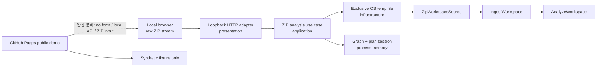
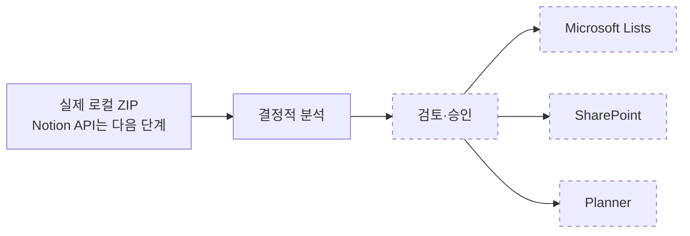

# Notion2Loop

[](https://github.com/t-hajongkim/test/actions/workflows/ci.yml)

Notion2Loop는 Notion 내보내기 자료를 읽고, Microsoft Loop로 옮길 때 무엇을 그대로 살릴 수 있고 무엇을 사람이 검토해야 하는지 보여 주는 **로컬 실행형 프로토타입**입니다.

> [!IMPORTANT]
> [공개 데모](https://t-hajongkim.github.io/test/)는 **실제 이전 서비스가 아닌 합성 샘플 기반 오프라인 분석 데모**입니다. 저장소의 가상 fixture만 분석하며 실제 Notion API나 Microsoft Loop에 연결하지 않습니다.
>
> 화면의 **73%는 실제 완료율이 아닌 예상 의미 보존 점수**입니다. 실제 Notion 자료, 회사 문서, 개인정보, `.env` 또는 토큰을 이 저장소에 업로드하거나 커밋하지 마세요.

## CI와 공개 데모

CI는 모든 main 대상 pull request와 main push에서 Node.js 24로 타입·테스트·빌드와 로컬 데모 생성을 검증합니다. pull request에서는 여기까지만 실행하고 배포하지 않습니다.

main push에서는 `Validate prototype` 성공 후에만 합성 fixture로 `output/demo`를 새로 만들고, 모든 HTML/JSON의 절대 경로, `file://` URI, 이메일, 전화번호, 토큰 형태 값을 검사합니다. 통과한 디렉터리만 workflow artifact로 전달해 공식 GitHub Pages actions로 배포합니다. `build-pages`와 `deploy`가 `validate`를 `needs`로 요구하므로 검증 실패 시 배포되지 않습니다.

Pages를 사용하려면 저장소가 GitHub Pages를 지원하는 공개 범위 또는 요금제여야 하며, **Settings → Pages → Build and deployment → Source**가 **GitHub Actions**로 설정되어야 합니다.

## 빠르게 실행하기

Node.js 24가 필요합니다. 터미널에서 `node --version`을 실행했을 때 `v24`로 시작하는지 확인하세요.

```powershell
npm ci
npm run typecheck
npm test
npm run build
npm run local-app
npm run demo
npm run public-demo
npm run check:public-demo
npm run serve
```

`npm run local-app`을 실행한 뒤 브라우저에서 <http://127.0.0.1:4174>를 열면 **로컬 연결 마법사**를 사용할 수 있습니다. 첫 화면의 **시작**을 누르고 Source, Notion, Microsoft, Target, 향후 흐름을 차례로 확인합니다. ZIP 설정을 저장한 뒤 **로컬 분석**을 누르면 실제 ZIP을 읽어 canonical graph와 호환성 분석 요약을 만듭니다. 서버를 끝내려면 터미널에서 `Ctrl+C`를 누르세요.

설정 저장 단계에서는 ZIP 이름과 크기만 프로세스 메모리에 둡니다. **로컬 분석**을 누른 뒤에만 브라우저가 ZIP 바이트를 같은 origin의 `127.0.0.1` endpoint로 보냅니다. ZIP은 인터넷이나 Microsoft/Notion 서비스로 전송되지 않고 PC 밖으로 나가지 않습니다. 서버는 요청 body를 통째로 메모리에 모으지 않고 OS 임시 디렉터리의 무작위·독점 파일로 스트리밍한 뒤 성공과 실패 모두에서 삭제합니다.

canonical graph와 migration plan은 해당 프로세스의 세션 메모리에만 남습니다. API와 화면에는 항목·관계·경고 수, 상태별 개수, issue 수, agent task 수, 예상 의미 보존 점수만 반환합니다. ZIP 원문, 원문 content, 절대 경로, token은 응답·로그·`localStorage`·`sessionStorage`·`output/`에 기록하지 않습니다. 화면의 **Notion 토큰 지우기** 또는 **세션 종료 및 모두 삭제**를 사용하거나 서버를 종료하면 세션의 token, graph, plan 참조를 제거합니다. JavaScript 런타임 특성상 물리 메모리의 즉시 완전 소거를 보장하는 기능은 아닙니다.

기존 합성 데모 검토 화면은 `npm run demo` 후 `npm run serve`로 실행하고 <http://127.0.0.1:4173>에서 봅니다. `local-app`과 `serve`는 서로 다른 화면과 포트를 사용합니다.

직접 준비한 로컬 내보내기를 분석하려면 다음 명령을 사용할 수 있습니다. 입력 폴더나 ZIP은 저장소 밖에 두는 것을 권장합니다.

```powershell
npm run migrate -- --input "..\notion-export" --output output\migration
npm run serve -- --directory output\migration
```

일반 `migrate`와 `demo`의 `output/`에는 입력·출력 위치 같은 로컬 절대 경로가 포함될 수 있으므로 Git에서 항상 제외됩니다. 공개용 `public-demo`만 합성 fixture를 강제하고 공개 메타데이터로 생성한 뒤 전체 파일을 검사합니다.

## 현재 할 수 있는 일

- 살균된 Notion Markdown/CSV 디렉터리 또는 ZIP과 보조 API 스냅샷 읽기
- 페이지, 데이터베이스, 행, 첨부 파일, 계층과 관계를 정규화한 그래프로 만들기
- 항목을 `native`, `transformed`, `manual`, `blocked`로 분류하기
- 수식, 롤업, 관계, 지원되지 않는 블록에 대한 검토 작업 만들기
- 위험한 경로, 너무 큰 입력, 소스 안의 명령문 형태 텍스트를 탐지하기
- 정제된 HTML 미리보기, JSON 보고서, 로컬 정적 대시보드 만들기
- localhost 화면에서 실제 ZIP을 임시 파일로 스트리밍하고 기존 ingestion과 호환성 분석 실행하기

데모 화면의 **73%는 실제 자료의 73%가 이전되었다는 뜻이 아닙니다.** 가상 fixture의 항목과 관계에 가중치를 적용해 계산한 **예상 의미 보존 점수**입니다. 실제 이전 완료율, 정확도 또는 Microsoft Loop 반영 결과로 해석하면 안 됩니다.

## 구조

이 프로젝트는 한 프로세스에서 로컬 파일을 처리하는 **로컬 우선 모듈러 모놀리스**이며, 기능별로 코드를 모으는 feature-first DDD 방식을 사용합니다.

```text
src/features/
  workspace-ingestion/       # Notion 내보내기 읽기와 정규화
  compatibility-analysis/    # 호환성 및 예상 의미 보존 분석
  loop-package/              # 정적 검토 패키지 생성과 로컬 제공
  migration-run/             # 전체 흐름과 CLI
  public-demo/               # 합성 fixture 계약과 공개 산출물 개인정보 검사
  connection-setup/          # localhost 연결, bounded ZIP 획득, 메모리 분석 세션, 단계형 UI
```

각 기능 안에서 `domain`, `application`, `infrastructure`, `presentation` 계층을 필요한 만큼 나눕니다. 외부 서비스 연결보다 도메인 규칙과 로컬 검토 흐름을 먼저 검증하도록 설계했습니다.



로컬 마법사는 한 사용자 행동을 한 feature에서 끝까지 연결합니다. 레이어별로 별도 브랜치를 만들지 않으며, dependency는 presentation/infrastructure에서 application/domain 방향으로 향합니다.



ZIP 경로의 실선은 이번 수직 슬라이스에서 실제로 동작합니다. `configuration_ready`는 설정만 저장된 상태이고, `analysis_ready`는 ZIP 바이트를 확보한 뒤 기존 ingestion과 compatibility analysis가 성공한 상태입니다. Notion API 수집, 검토·승인, Microsoft 인증과 배포는 후속 단계입니다.

## 로컬 ZIP 분석 상태와 제한

| 상태 | 뜻 |
| --- | --- |
| `uploading` | ZIP을 이 PC의 OS 임시 파일로 받는 중입니다. |
| `analyzing` | ZIP 검증, canonical graph 생성, 호환성 분석을 실행 중입니다. |
| `analysis_ready` | 실제 입력으로 graph와 migration plan이 만들어졌습니다. |
| `failed` | 입력 또는 분석이 실패했으며 graph와 plan을 준비 완료로 저장하지 않았습니다. |

압축된 ZIP과 압축 해제 후 전체 크기는 각각 최대 **200MB**, 개별 엔트리는 최대 **16MB**, 파일 수는 최대 **10,000개**입니다. 선언된 `Content-Length`와 chunked 전송의 실제 바이트를 모두 검사합니다. 임시 ZIP은 다시 통째로 읽지 않고 bounded chunk로 해제하며, parser에는 검증이 끝난 현재 엔트리 버퍼만 전달합니다. ZIP이 주장하는 크기만 믿지 않고 streaming 해제 중 실제 바이트를 다시 세며, 실제 크기와 CRC도 중앙 디렉터리 값과 대조합니다. 빈 파일, ZIP이 아닌 파일, 손상된 구조·JSON·CSV, 상위 폴더로 벗어나는 경로, 중복 경로, 크기·파일 수 초과는 명시적인 4xx 오류로 중단됩니다. 진행 중인 세션에 같은 분석을 다시 요청하면 두 작업을 섞지 않고 거절합니다.

오류가 나면 Notion에서 ZIP을 다시 내보내거나 큰 workspace를 나누어 시도하세요. 다음 source 단계는 관계 ID와 최신 schema를 보강하는 **읽기 전용 Notion API 수집**이며, 이번 로컬 ZIP 분석에서는 외부 API를 호출하지 않습니다.

## 연결 용어

| 용어 | 쉬운 설명 |
| --- | --- |
| Notion token | Notion integration이 허용된 페이지를 읽을 때 쓰는 비밀 열쇠입니다. 공유하거나 저장소에 올리면 안 됩니다. |
| Tenant ID | 회사나 조직의 Microsoft Entra 디렉터리를 구분하는 ID입니다. |
| Client ID | Microsoft에 등록한 이 마이그레이션 앱을 구분하는 ID입니다. secret 자체가 아닙니다. |
| delegated login | 사용자가 직접 로그인하고 동의한 권한 범위 안에서 앱이 사용자를 대신해 작업하는 방식입니다. |
| Microsoft Graph | Lists, SharePoint, Planner 같은 Microsoft 365 서비스에 접근하는 공식 API입니다. |
| 권한 동의 | 앱이 어떤 데이터와 작업에 접근할 수 있는지 사용자가 확인하고 허용하는 절차입니다. 이번 단계에서는 실행하지 않습니다. |

## 보안과 개인정보

> [!CAUTION]
> 실제 Notion 내보내기, ZIP, 회사 문서, 개인정보, `.env` 파일, API 토큰 또는 인증 키를 커밋하지 마세요. `output/migration`이나 기존 `output/` 파일을 GitHub Pages에 수동 업로드하지 마세요. 한번 공개 저장소나 Pages에 올라간 비밀은 파일을 지워도 기록에 남을 수 있습니다.

저장소에는 제품 동작을 시험하기 위한 가상 fixture만 포함됩니다. 공개 workflow는 기존 출력물을 재사용하지 않고 이 fixture로만 새 산출물을 생성합니다. `.env.example`은 변수 이름만 보여 주며 실제 값은 비어 있습니다. 현재 프로토타입은 이 토큰들을 사용하지 않습니다.

로컬 연결 마법사 서버는 `127.0.0.1`에만 bind하고 정확한 Host와 same-origin `Origin`을 검사합니다. 설정 JSON의 기존 16KiB 제한은 그대로 유지하며, ZIP endpoint에는 별도의 200MB 압축 크기 상한과 기존 해제 크기·파일 수 상한을 적용합니다. 모든 응답은 `no-store`, CSP, framing 차단, referrer 제한 등 보안 헤더를 사용합니다. 이는 공개 서비스용 로그인 경계가 아니라 한 사용자 PC에서 다음 마이그레이션 단계를 준비하기 위한 localhost 경계입니다.