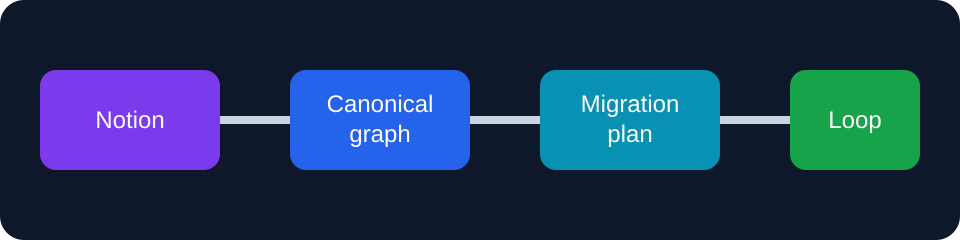

# Notion2Loop Demo

This sanitized workspace exercises hierarchy, rich text, databases, relations,
formulas, rollups, internal links, files, and unsupported blocks.

## Workspace map

- [Projects](Projects%2022222222222222222222222222222222.csv)
- [Tasks](Tasks%2055555555555555555555555555555555.csv)
- [Project Alpha](Projects%2022222222222222222222222222222222/Project%20Alpha%2033333333333333333333333333333333.md)

## Migration goals

- [x] Preserve page hierarchy.
- [x] Preserve database row identity.
- [ ] Recreate relations after all target objects exist.
- [ ] Review formula and rollup mappings.

<aside>
This callout is exported as HTML because Markdown has no native callout syntax.
</aside>



```text
Notion API + export -> Canonical graph -> Compatibility plan -> Loop package
```
